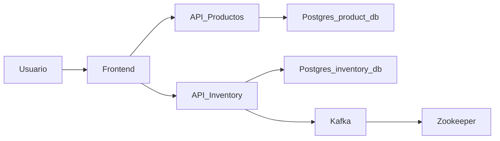

# 🏗️ Proyecto: Microservicios con Docker (React + Spring Boot + Kafka + Postgres) - Prueba Tecnica


---

## 🧩 Diagrama de arquitectura (Mermaid)



---

# Inicio Rapido

Sigue estos pasos para tener el proyecto corriendo en pocos minutos usando **Docker**.

### Requisitos previos
- Tener instalado **Docker** y **Docker Compose**  
  (puedes verificar con: `docker --version` y `docker compose version`)

### Paso a paso

1. **Crear y entrar en una carpeta para el proyecto**

    ```bash
    mkdir linktic
    cd linktic
    ```
    o en su defecto entrar en esta carpeta

2. **Clonar Repo**
`git clone https://github.com/HellFramco/linktic.git`

3. **Generar Contenedor, imagenes, volumen y servicios**
`docker compose build`
Es muy importante recalcar que debes tener Docker

4. **Levantar o correr el contenedor**
`docker compose up -d`
# Esperar 5 minutos a que todos los servicios esten corriendo y luego ya estara listo

---

## 📁 Estructura del repositorio

```
LINKTIC

│ .gitignore
│ docker-compose.yml   # Configuracion Principal del Contenedor
│
├── back/              # Configuracion inicial DB
│ ├── db/
│ │ └── init.sql
│ │
│ ├── inventory/       # Microservicio Inventory
│ │ ├── Dockerfile
│ │ ├── src/
│ │ └── pom.xml
│ │
│ └── products/        # Microservicio Productos
│   ├── Dockerfile
│   ├── src/
│   └── pom.xml
│
└── front/              # Front (React)
  ├── Dockerfile
  ├── nginx.conf
  ├── src/ # React + Vite
  └── public/
```

---

## 🐳 Contenedores (Docker Compose)

El archivo `docker-compose.yml` levanta los siguientes contenedores:

| Servicio | Contenedor | Puerto | Rol |
|---------|------------|--------|-----|
| PostgreSQL | `postgres-db` | 5433 | Base de datos |
| API Productos | `api-productos` | 8081 | Microservicio productos |
| API Inventory | `api-inventory` | 8082 | Microservicio inventario |
| Kafka | `kafka` | 9092 | Broker de eventos |
| Zookeeper | `zookeeper` | 2181 | Coordinador de Kafka |
| Frontend | `nginx-frontend` | 80 | Servidor web (React + Nginx) |

---

## ⚙️ Servicios

### ✅ PostgreSQL (Base de datos)

- Contenedor: `postgres-db`
- Imagen: `postgres:15`
- Base de datos: `product_db`
- Script de inicialización: `back/db/init.sql`
- Volumen persistente: `postgres-data`

---

### ✅ API Productos (`api-productos`)

- Construido desde: `back/products`
- Puerto: **8081**
- Conexión a Postgres: `SPRING_DATASOURCE_URL=jdbc:postgresql://postgres-db:5432/product_db`
- API key: `producto-api-linktic`

---

### ✅ API Inventory (`api-inventory`)

- Construido desde: `back/inventory`
- Puerto: **8082**
- Conexión a Postgres: `SPRING_DATASOURCE_URL=jdbc:postgresql://postgres-db:5432/inventory_db`
- API key: `inventory-api-linktic`
- Consume eventos de Kafka (p. ej. `ProductCreatedEvent`)

---
### ✅ Kafka + Zookeeper

- Kafka: `kafka` (puerto 9092)
- Zookeeper: `zookeeper` (puerto 2181)

---

### ✅ Frontend (React + Vite + Nginx)

- Construido desde: `front`
- Servido con Nginx
- Puerto: **80**

---

## 🔁 Arquitectura y comunicación

📌 **Flujo de comunicación:**

1. El usuario accede al frontend (Nginx).
2. Frontend realiza peticiones a:
 - `api-productos` (8081)
 - `api-inventory` (8082)
3. APIs se conectan a **Postgres** para persistencia.
4. **Inventory** también consume eventos de Kafka.
5. Kafka depende de Zookeeper para coordinación.

---

## Comandos usados
### Levantar todo el stack
`docker-compose up --build`

### Parar el stack
`docker-compose down`

### Levantar en segundo plano
`docker-compose up -d --build`

---

# Inventory Service

## Introducción
Microservicio responsable de la gestión de inventario y del flujo de compra.
Forma parte de una arquitectura de microservicios junto con `products`.

## Arquitectura
- Spring Boot 3
- REST síncrono
- Base de datos por microservicio
- Comunicación HTTP entre servicios

## Decisiones técnicas
- Transactional Script para el flujo de compra
- Anti-Corruption Layer para integración con Product Service
- API Key simple entre microservicios
- JSON:API como contrato de respuesta
- Retry + timeout para resiliencia básica

## Modelo
Inventory:
- productId
- quantity
- state

## Endpoints
- GET /inventory/{productId}
- PUT /inventory/{productId}
- POST /purchases

## Flujo de compra
1. Inventory recibe request
2. Llama a Product Service
3. Verifica existencia
4. Verifica stock
5. Descuenta inventario (transacción)
6. Retorna compra
7. Registra historial (futuro)

## Seguridad
- Header: X-API-KEY
- Validación vía OncePerRequestFilter
- Keys configuradas por variables de entorno

## Manejo de errores
- 404: Producto inexistente
- 409: Inventario insuficiente
- 504: Timeout Product Service

## Testing
- Unitarios: servicios con mocks
- Integración: @SpringBootTest + H2
- Un test real por microservicio

## Git Flow
- main
- develop
- feature/product
- feature/inventory
- feature/purchase

## Uso de IA
ChatGPT fue utilizado como apoyo para:
- Definición de arquitectura
- Estructura del proyecto
- Buenas prácticas y patrones

## Mejoras futuras
- Event-driven con Kafka
- Saga Pattern
- Circuit Breaker (Resilience4j)
- Cache de productos (Redis)
- Observabilidad (Prometheus + Grafana)

---

# Products Service

## Introducción
Microservicio responsable de la gestión de los productos.
Forma parte de una arquitectura de microservicios junto con `inventory`.

## Arquitectura
- Spring Boot 3
- REST síncrono
- Base de datos por microservicio
- Comunicación HTTP entre servicios

## Decisiones técnicas
- Anti-Corruption Layer para integración con Product Service
- API Key simple entre microservicios
- JSON:API como contrato de respuesta
- Retry + timeout para resiliencia básica

## Modelo
Products:
- id
- name
- price
- description
- state
- imageUrl

## Endpoints
- GET /products/{id}
- PUT /products/{id}
- DELETE /products/{id}
- GET /products
- POST /products
- GET /uploads/{filename}

## Seguridad
- Header: X-API-KEY
- Validación vía OncePerRequestFilter
- Keys configuradas por variables de entorno

## Manejo de errores
- 404: Producto inexistente
- 409: Inventario insuficiente
- 504: Timeout Product Service

## Testing
- Unitarios: servicios con mocks
- Integración: @SpringBootTest + H2
- Un test real por microservicio

## Git Flow
- main
- develop
- feature/product
- feature/inventory
- feature/purchase

## Uso de IA
ChatGPT fue utilizado como apoyo para:
- Definición de arquitectura
- Estructura del proyecto
- Buenas prácticas y patrones
GROCK fue utilizado como apoyo para:
- Arquitectura de procesos
- Diagramas de uso
- Documentacion 
- Limpieza de codigo y bugs
- Schemas
- Arquitectura de componentes
- Semantica de servicios

## Mejoras futuras
- Saga Pattern
- Circuit Breaker (Resilience4j)
- Cache de productos (Redis)
- Observabilidad (Prometheus + Grafana)
